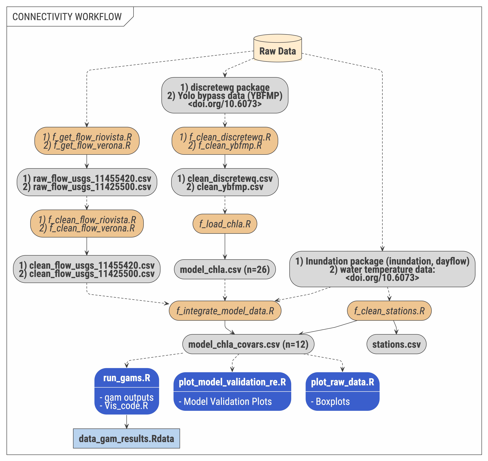

# swg-21-connectivity

Connectivity synthesis subgroup

This repository provides the data inputs and analysis associated with NCEAS Bay Delta Synthesis. Data are stored in `data_raw`, or when possible, directly read from a repository and cleaned, and stored in `data_clean`. Data are integrated and joined as necessary to create modeling inputs for analysis.

